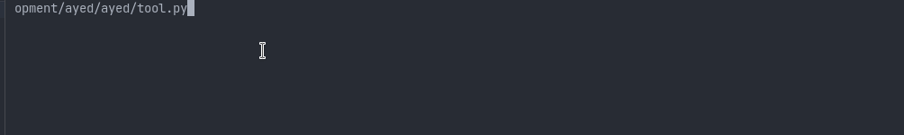

## AyED Tools
## Instalación
```zsh
bocanada in ~/Dev/ayed/ayed on main ● λ $ pip install ayed
```
Requiere `python3.8^`*
## Uso fn generator
```zsh
$ bocanada in ~/Dev/ayed/ayed on main ● λ $ ayed
1. Coll fn generator
2. Files generator
Option [1/2]: 1
Open editor? [y/n] (y): n
Enter path to a .cpp[,.hpp,.c,.h]: 
You should enter a path.
Enter path to a .cpp[,.hpp,.c,.h]: tests/structs/structs.cpp
[11:41:14]  Wrote /home/bocanada/Dev/ayed/output_files/21-06-21- printer.py:41
                                     1141.hpp                                        
             Wrote TtoDebug, TtoString, TfromString and newT for Equipo              
                                    Done! Bye! 👋                          tool.py:83👋 
```
Si en `Open editor? [y/n] (y)` especifican que sí, o simplemente presionan enter, se les abrirá un editor - NOTEPAD en windows, vi/vim/nano/$EDITOR en linux - y ahí podrán escribir y/o pegar su código.

## Uso files generator
```zsh
$ bocanada in ~/Dev/ayed on main ● λ ayed
1. Coll fn generator
2. Files generator
Option [1/2]: 2
Enter path to a .xlsx 👀 (AlgoritmosFiles.xlsx): 
Por default, esto abrirá el excel y escribirá archivos en output_files/[...].dat. 
Continuar? [y/n] (y): 
[11:37:28]           Found 3 structs in Compañía de aviación 🙉           excel.py:42
                              VUELOS.dat - 64 bytes                    classes.py:130
                         ┏━━━━━━━┳━━━━━┳━━━━━━━┳━━━━━━━┓                             
                         ┃ idVue ┃ cap ┃ idOri ┃ idDes ┃                             
                         ┡━━━━━━━╇━━━━━╇━━━━━━━╇━━━━━━━┩                             
                         │   1   │ 10  │   1   │   4   │                             
                         ├───────┼─────┼───────┼───────┤                             
                         │   2   │ 15  │   2   │   1   │                             
                         ├───────┼─────┼───────┼───────┤                             
                         │   3   │ 12  │   4   │   3   │                             
                         ├───────┼─────┼───────┼───────┤                             
                         │   4   │  5  │   3   │   2   │                             
                         └───────┴─────┴───────┴───────┘
                                      ...
```
